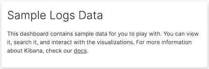

[float]
[[add-text]]
== Create text panels

To provide context to your dashboard panels, add *Text* panels that display important information, instructions, links, and more. 
You create *Text* panels using GitHub-flavored markdown. For detailed information about using GitHub-flavored markdown, click *Help*.
+
[role="screenshot"]

. Open or create a dashboard.

. In the dashboard toolbar, click image:images/dashboard_createNewTextButton_7.15.0.png[Create New Text button in dashboard toolbar].

. In the *Markdown* field, enter the text you want to display. For example:
+
[source,text]
-------------------
## Sample Logs Data
This dashboard contains sample data for you to play with. 
You can view it, search it, and interact with the visualizations. 
For more information about Kibana, check our [docs](https://www.elastic.co/guide/en/kibana/current/index.html).
-------------------

. Click *Update*.

[float]
[[save-the-markdown-panel]]
=== Save the panel

Save and add the text panel to the dashboard, or save to the *Visualize Library* to use the panel on multiple dashboards.

To save and add the panel to the dashboard:

. Click *Save and return*.

. To add a title to the panel, click *No Title* on the panel.

. On the *Panel settings* flyout, select *Show title*.

. Enter the *Title* and an optional *Description*, then click *Save*.

To save the panel to the *Visualize Library*:

. Click *Save to library*.

. Enter the *Title* and an optional *Description*. 

. Add any applicable <<managing-tags,*Tags*>>.

. Make sure that *Add to Dashboard after saving* is selected.

. Click *Save and return*.