[[dashboard]]
= Dashboard and visualizations

[partintro]
--
**_Visualize your data with dashboards._**

The best way to understand your data is to visualize it. With dashboards, you can turn your data from one or more <<data-views, data views>> into a collection of panels 
that bring clarity to your data, tell a story about your data, and allow you to focus on only the data that's important to you. 

[role="screenshot"]
image:images/dashboard_ecommerceRevenueDashboard_7.15.0.png[Example dashboard]

Panels display your data in charts, tables, maps, and more, which allow you to compare your data side-by-side to identify patterns and connections. 
Dashboards support several types of panels that display your data.

[cols="50, 50"]
|===

a| *Tabular*

Tabular visualizations organize your data into tables, which are highly customizable and allow you to align the text, format the values, apply different colors to cell and text values, and more.
You can use tables to display server configuration details, track counts, min, or max values for a specific field, and monitor the status of key services.

| 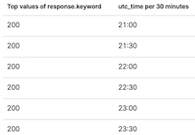

a| *Bar*

Displays bars side-by-side where each bar represents a category. Use bar charts to compare data across a
large number of categories, display categorial data with negative values, and easily identify
the categories that represent the highest and lowest values. {kib} supports horizontal, vertical, stacked, and percentage bar charts.

| 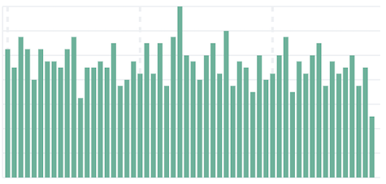

a| *Goal and single value*

Goal and single value visualizations convey a clear understanding of how a specific indicator behaves. 
The primary goal is to display a number of the most accurate, precise, and immediate value. 
{kib} supports gauge horizontal, gauge vertical, and metric visualizations.

| 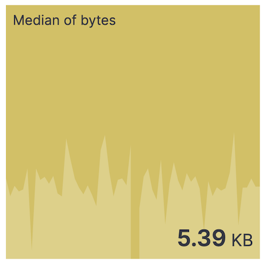

a| *Line and area*

Line and area charts allow you visualize trends in data over time. Use line and area charts to visualize your time series data. 
Line charts display your data as a series of ordered measurement points, typically by the x-axis values, which are connected by segments of straight lines. 
Area charts are similar, but the space below the line is shaded. {kib} supports stacked and percentage area charts.

| 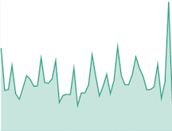

a| *Magnitude*

Displays graphical representations of data in heat map visualizations, where the individual values are represented by colors. Use heat maps when your data set includes
categorical data.

| 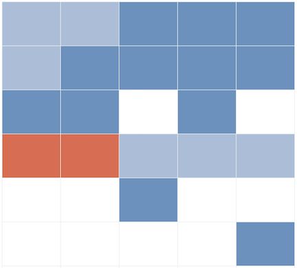

a| *Map*

Create beautiful displays of your geographical data. For more information, check <<maps,Maps>>.

| 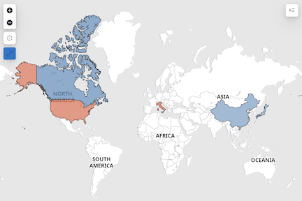

a| *Proportion*

Displays the relative size of data categories compared to the proportion or percentage of a whole. 
Use proportional visualizations to show complex categorical data, and help to quickly identify patterns and trends. 
{kib} supports donut, mosaic, pie, treemap, and waffle visualizations.

| 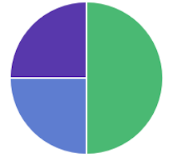

a| *Tag cloud*

Displays graphical representations of how frequently a word appears in the data source. Use tag cloud visualizations to show a summary of large documents and
create visual art for a specific topic.

| 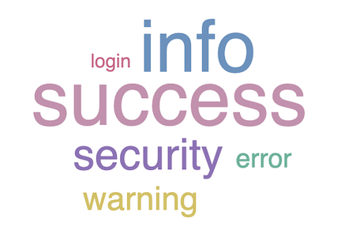

a| *Machine Learning*

Displays machine learning anomaly detection results in a timeline or chart. For detailed information, check <<xpack-ml-anomalies,Anomaly detection>>.

| 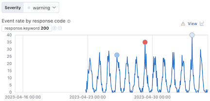

a| *Log stream*

Displays a table of live streaming logs. For detailed information, check <<logs-app,log stream>>.

| 

| *Interactive filter controls*

Displays dropdown and slider filter controls that allow you to interact with your dashboard data.

| 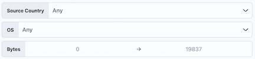

| *Text*

Displays panels of text to add context to the other panels on your dashboard.

| 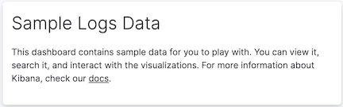

| *Images*

Personalize your dashboard with images, such as icons and logos.

| 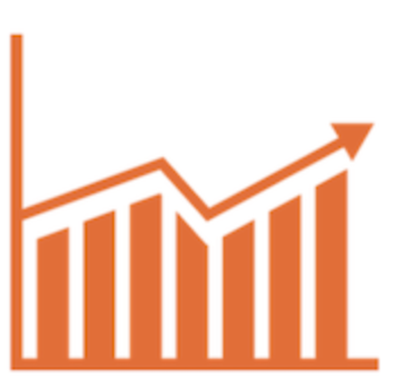

|===

[float]
[[dashboard-minimum-requirements]]
== Minimum requirements

To create dashboards, you must meet the minimum requirements. 

* If you need to set up {kib}, use https://www.elastic.co/cloud/elasticsearch-service/signup?baymax=docs-body&elektra=docs[our free trial].

* Make sure you have {ref}/getting-started-index.html[data indexed into {es}] and a <<data-views, data view>>.

* When the read-only indicator appears, you have insufficient privileges
to create or save dashboards, and the options to create and save dashboards are not visible. For more information,
refer to <<xpack-security-authorization,Granting access to {kib}>>.

[float]
[[create-dashboards]]
== Create dashboards

Dashboards provide you with the space where you add and display panels of your data. Begin with an empty dashboard, or open an existing dashboard.

. Open the main menu, then click *Dashboard*.

. On the *Dashboards* page, choose one of the following options:

* To start with an empty dashboard, click *Create dashboard*.
+
When you create a dashboard, you are automatically in edit mode and can make changes to the dashboard. 

* To open an existing dashboard, click the dashboard *Title* you want to open.
+
When you open an existing dashboard, you are in view mode. To make changes to the dashboard, click *Edit* in the toolbar. 

[[tsvb]]

[float]
[[create-panels-with-lens]]
== Add panels to the dashboard

The dashboard toolbar provides you with several options to add panels to dashboards.

To add panels, choose from the following options:

* *Create visualization* &mdash; Opens the drag-and-drop visualization editor, which is the recommended way to create visualization panels of your data.

* *Text* &mdash; When you click image:images/dashboard_createNewTextButton_7.15.0.png[Text icon in the dashboard toolbar], opens the markdown editor.

* *Image* &mdash; When you click image:images/dashboard_createNewImageButton_8.7.0.png[Image icon in the dashboard toolbar], opens the *Add image* flyout.

* *Maps* &mdash; When you click , opens the map visualization editor.

* *Select type* &mdash; Opens the menu for all supported visualization editors and panel types. 

* *Add from library* &mdash; Allows you to add visualizations from the *Visualize Library*.

* *Controls* &mdash; Opens the menu for the interactive filter control options. 

[float]
[[arrange-panels]]
[[moving-containers]]
[[resizing-containers]]
== Arrange panels

Organize panels on the dashboard by priority, resize panels, and more.

To arrange panels, use the following options:

* To move, click and hold the panel header, then drag to the new location.

* To resize, click the resize control, then drag to the new dimensions.

[float]
[[duplicate-panels]]
== Duplicate panels

To duplicate panels and the configured functionality, use the clone and copy panel options. Cloned and copied panels replicate all of the functionality from the original panel, 
including renaming, editing, and cloning. 

[float]
[[clone-panels]]
=== Clone panels

Cloned panels appear next to the original panel, and move the other panels to provide space on the dashboard.

. Open the panel menu.

. Select *Clone panel*.

[float]
[[copy-to-dashboard]]
=== Copy panels

Copy panels from one dashboard to another dashboard.

. Open the dashboard that contains the panel you want to copy.

. In the toolbar, click *Edit*.

. Open the panel menu, then select *More > Copy to dashboard*.

. On the *Copy to dashboard* window, select the dashboard for where you want to display the copied panel, then click *Copy and go to dashboard*.

[float]
[[save-dashboards]]
== Save dashboards

To share the dashboard with others in your organization, save the dashboard.

. In the toolbar, click *Save*.

. On the *Save dashboard* window, enter the *Title* and an optional *Description*.

. Add any applicable <<managing-tags,*Tags*>>. 

. To save the time filter to the dashboard, select *Store time with dashboard*.

. Click *Save*.

[float]
[[share-the-dashboard]]
== Share dashboards

Share the dashboard with others in your organization. For detailed information about the share options, check <<reporting-getting-started,Reporting>>.

. In the toolbar, click *Share*. 

. On the *Share this dashboard* window, choose from the following options:

* *Embed code* &mdash; Embed fully interactive dashboards as an iframe on web pages.

* *Get links* &mdash; Share direct links to dashboards.

* *PDF Reports* &mdash; Generate and download PDF files of dashboards.

* *PNG Reports* &mdash; Generate and download PNG files of dashboards.

[float]
[[import-dashboards]]
== Export dashboards

To automate {kib}, you can export dashboards as NDJSON using the <<saved-objects-api-export, Export objects API>>. It is important to export dashboards with all necessary references.

[WARNING]
============================================================================
When you export dashboards, {kib} is unable to export uploaded image files. 
When you import dashboards with unavailable image panels, the image panel displays a `not found` warning. To import the dashboard with the image panel, re upload the image. For more information about image panels, check <<add-image,Create image panels>>.
============================================================================

--
include::panels/create-panels.asciidoc[]

include::panels/create-panels-with-editors.asciidoc[]

include::make-dashboards-interactive.asciidoc[]

include::panels/save-panels.asciidoc[]

include::tutorial-create-a-dashboard-of-lens-panels.asciidoc[]

include::lens-advanced.asciidoc[]

include::edit-dashboards-and-panels.asciidoc[]

include::dashboard-troubleshooting.asciidoc[]
