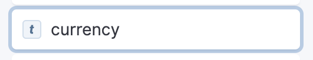
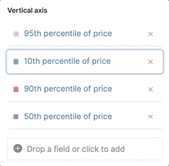

[[lens]]
== Create visualization panels
With the drag-and-drop visuaization editor, you can create a variety of visualizations to display your data. 

[float]
[[find-your-lens-data]]
=== Find your data
Tell {kib} where to find the data you want to visualize, then specify the time range.

. Open the main menu, then select *Dashboard*.

. Open or create a dashboard. 

. On the dashboard, click *Create visualization*.

. Open the {data-source} dropdown, then select the {data-source} you want to visualize. 
+
{kib} uses <<data-views,{data-sources}>> to find your {es} data.
To view the ecommerce sample data, open the {data-source} menu, and then select **Kibana Sample Data Ecommerce**.
+
To create a {data-source} for your own data, click *Create a data view*.
For details, check <<data-views, Create a {data-source}>>.
+
To learn about the data in a field, click the field.

. Adjust the <<set-time-filter,time range>> to view data for the *Last 7 days*.
+
The range selection is based on the default time field in your data.
If you are using the sample data, the value is set for when you added the data.
If you are using your own data, and it does not have a time field, the range selection is unavailable.

[float]
[[visualize-the-fields-in-your-data]]
=== Visualize the fields in your data
The drag-and-drop visualization editor allows you to drag the fields you want to visualize to the workspace, then uses best practices to create a 
visualization that best displays your data.

TIP: You can manually apply the changes you make, which is helpful when creating large and complex visualizations. To manually apply your changes, 
click *Settings* in the toolbar, then deselect *Auto-apply visualization changes*.

. Drag the *products.price* field to the workspace.

. In the layer pane, click *Median of products.price*, then click the *Average* function.

. In the *Name* field, enter `Average price`, then click *Close*.

. Open the *Visualization type* dropdown, then select *Area*.

Create visualization layers.

. In the layer pane, click *Add layer > Visualization*.

. Drag the *customer_id* field to the *Vertical Axis* field in the second layer, then click *Unique count of customer_id*.

.. In the *Name* field, enter `Number of customers`.

.. In the *Series color* field, enter `#D36086`.

.. Click *Right* for the *Axis side*, then click *Close*.
+
image::images/lens_advancedTutorial_numberOfCustomers_8.5.0.png[Number of customers area chart in Lens]

. Drag the *order_date* field to the *Horizontal Axis* field in the second layer.

. Open the *Layer visualization type* menu for the second layer, then click *Line*.
+
[role="screenshot"]
image::images/lens_layerVisualizationTypeMenu_7.16.png[Layer visualization type menu]

. Open the *Legend* menu, then select the *Alignment* arrow that displays the legend above the visualization.
+
[role="screenshot"]
image::images/lens_mixedXYChart_7.16.png[Layer visualization type menu]

Each visualization type allows you to configure a variety of components, including:

* *Visual options* &mdash; Specifies how to display area, line, and bar chart options. For example, you can specify how to display the labels in bar charts.

* *Labels* &mdash; Specifies how to display the labels for donut charts, pie charts, and treemaps. 

* *Legend* &mdash; Specifies how to display the legend. For example, you can display the legend inside the visualization and truncate the legend values.

* *Left axis*, *Bottom axis*, and *Right axis* &mdash; Specify how you want to display the chart axes. For example, add axis labels and change the orientation and bounds.

. To add the visualization to the dashboard, click *Save and return*.

[float]
[[lens-formulas]]
=== Use formulas to perform math

Formulas allow you to do math using a combination of {es} aggregations and math functions. The most common formulas divide two values to produce a percent.

. In the layer pane, click a field.

. Click *Formula*, then enter the formula. 
+
Filter ratio example:: To filter a document set, use `kql=''`, then compare to other documents within the same grouping:
+
```
count(kql='response.status_code > 400') / count()
```
+
Week over week example:: To get the value for each grouping from the previous week, use `shift='1w'`.
+
```
percentile(system.network.in.bytes, percentile=99) /
percentile(system.network.in.bytes, percentile=99, shift='1w')
```
You are unable to combine different time shifts, such as `count(shift="1w") - count()` and `count(shift="1w") - count(shift="1m")`, with the *Top values* function.
+
Percent of total example:: To convert each grouping into a percent of the total, formulas calculate `overall_sum` for all groupings:
+
```
sum(products.base_price) / overall_sum(sum(products.base_price))
```
TIP: For detailed information on formulas, click image:dashboard/images/formula_reference.png[Formula reference icon].

. To accurately display the formula, select *Percent* from the *Value format* dropdown.

[float]
[[compare-data-with-time-offsets]]
=== Compare differences over time

Compare your real-time data to the results that are offset by a time increment. For example, you can compare the real-time percentage of a user CPU time spent to the results offset by one hour. 

. In the layer pane, click the field you want to offset.

. Click *Advanced*.

. In the *Time shift* field, enter the time offset increment. 

For a time shift example, check <<compare-time-ranges>>.

[float]
[[create-partition-charts-with-multiple-metrics]]
=== Create partition charts with multiple metrics

To create partition charts, such as pie charts, you configure one or more *Slice by* dimensions to define the partitions, and a *Metric* dimension to define the size. 
To create partition charts with multiple metrics, use the layer settings. Multiple metrics are unsupported for mosaic visualizations.

. In the layer pane, click image:dashboard/images/lens_layerActions_8.5.0.png[Actions menu for the partition visualization layer], then select *Layer settings*.

. Select *Multiple metrics*.

[float]
[[add-annotations]]
=== Add annotations

preview::[]

Annotations allow you to call out specific points in your visualizations that are important, such as significant changes in the data. You can add annotations for any {data-source}, add text and icons, specify the line format and color, and more.

[role="screenshot"]
image::images/lens_annotations_8.2.0.png[Lens annotations]

Annotations support two placement types:

* *Static date* &mdash; Displays annotations for specific times or time ranges.

* *Custom query* &mdash; Displays annotations based on custom {es} queries. For detailed information about queries, check <<semi-structured-search>>. 

Create the annotation layer. 

. In the layer pane, click *Add layer > Annotations*.

. Select the {data-source} for the annotation.

. From the fields list, drag a field to the *Add an annotation* field.

. To use global filters in the annotation, click image:dashboard/images/lens_layerActions_8.5.0.png[Actions menu for the annotations layer], then select *Keep global filters* from the dropdown.

Create static annotations.

. Select *Static date*.

. In the *Annotation date* field, click image:images/lens_annotationDateIcon_8.6.0.png[Annodation date icon in Lens], then select the date.

. To display the annotation as a time range, select *Apply as range*, then specify the *From* and *To* dates.

Create custom query annotations.

. Select *Custom query*.

. Enter the *Annotation query* for the data you want to display. 
+
For detailed information about queries and examples, check <<semi-structured-search>>.

. Select the *Target date field*.

Specify the annotation appearance.

. Enter the annotation *Name*.

. Change the *Appearance* options for how you want the annotation to display on the visualization.

. If you created a custom query annotation, click *Add field* to add a field to the annotation tooltip.

. To close, click *X*.

[float]
[[add-reference-lines]]
=== Add reference lines

With reference lines, you can identify specific values in your visualizations with icons, colors, and other display options. You can add reference lines to any visualization type that displays axes.

For example, to track the number of bytes in the 75th percentile, add a shaded *Percentile* reference line to your time series visualization.  

[role="screenshot"]
image::images/lens_referenceLine_7.16.png[Lens drag and drop focus state]

. In the layer pane, click *Add layer > Reference lines*.

. Click the reference line value, then specify the reference line you want to use:

* To add a static reference line, click *Static*, then enter the reference line value you want to use.

* To add a dynamic reference line, click *Quick functions*, then click and configure the functions you want to use.

* To calculate the reference line value with math, click *Formula*, then enter the formula.

. Specify the display options, such as *Display name* and *Icon*, then click *Close*.

[float]
[[filter-the-data]]
=== Search and filter your data

You can use the <<semi-structured-search, query bar>> to create queries that filter all the data in a visualization, or use the layer pane and legend filters to apply filters based on field values.

[float]
[[filter-with-the-function]]
==== Apply multiple KQL filters

With the *Filters* function, you can apply more than one KQL filter, and apply a KQL filter to a single layer so you can visualize filtered and unfiltered data at the same time.

. In the layer pane, click a field.

. Click the *Filters* function.

. Click *Add a filter*, then enter the KQL filter you want to apply.
+
To try the *Filters* function on your own, refer to <<custom-ranges,Compare a subset of documents to all documents>>.

[float]
[[filter-with-the-advanced-option]]
==== Apply a single KQL filter

With the *Filter by* advanced option, you can assign a color to each filter group in *Bar* and *Line and area* visualizations, and build complex tables. For example, to display failure rate and the overall data.

. In the layer pane, click a field.

. Click *Add advanced options*, then select *Filter by*.

. Enter the KQL filter you want to apply.

[float]
[[filter-with-legend-filters]]
==== Apply legend filters

Apply filters to visualizations directly from the values in the legend. *Bar*, *Line and area*, and *Proportion* visualizations support legend filters.

In the legend, click the field, then choose one of the following options:

* *Filter for value* &mdash; Applies a filter that displays only the field data in the visualization.

* *Filter out value* &mdash; Applies a filter that removes the field data from the visualization.

[float]
[[explore-lens-data-in-discover]]
=== Explore the data in Discover

When your visualization includes a single data view, you can open and explore the visualization data in *Discover*.

To get started, click *Explore data in Discover* in the toolbar.

For more information about exploring your data with *Discover*, check out <<discover,Discover>>.

[float]
[[drag-and-drop-keyboard-navigation]]
=== Create visualizations with keyboard navigation

To use a keyboard instead of a mouse, use the *Lens* fully accessible and continuously improved drag system.

. Select the field in the fields list or layer pane. Most fields have an inner and outer select state. The inner state opens a panel with detailed information or options. 
The outer state allows you to drag the field. Tab through the fields until you get the outer state on the field.
+
[role="screenshot"]


. Complete the following actions:

* To select a field, press Space bar.

* To select where you want to drop the field, use the Left and Right arrows.

* To reorder the fields on the layer pane, use the Up and Down arrows.

* To duplicate an action, use the Left and Right arrows, then select the *Drop a field or click to add* field you want to use.
+
[role="screenshot"]


. To confirm the action, press Space bar. To cancel, press Esc.

[float]
[[view-data-and-requests]]
=== View the visualization data and requests

To view the data included in the visualization and the requests that collected the data, use the *Inspector*.

. In the toolbar, click *Inspect*.

. Open the *View* dropdown, then click *Data*.

.. From the dropdown, select the table that contains the data you want to view.

.. To download the data, click *Download CSV*, then select the format type.

. Open the *View* dropdown, then click *Requests*.

.. From the dropdown, select the requests you want to view.

.. To view the requests in *Console*, click *Request*, then click *Open in Console*.

[float]
[[improve-visualization-loading-time]]
=== Improve visualization loading time

preview::[]

Data sampling allows you to improve the visualization loading time. To improve the performance, you use a lower sampling percentage, which lowers the accuracy. 
Use low sampling percentages on large datasets.

. In the layer pane, click image:dashboard/images/lens_layerActions_8.5.0.png[Actions menu for the partition visualization layer], then select *Layer settings*.

. To select the *Sampling* percentage, use the slider.

[float]
[[lens-faq]]
=== Frequently asked questions

For answers to common *Lens* questions, review the following. 

[discrete]
[[when-should-i-normalize-the-data-by-unit-or-use-a-custom-interval]]
.*When should I normalize the data by unit or use a custom interval?*
[%collapsible]
====
* *Normalize by unit* &mdash; Calculates the average for the interval. When you normalize the data by unit, the data appears less granular, but *Lens* is able to calculate the data faster. 

* *Customize time interval* &mdash; Creates a bucket for each interval. When you customize the time interval, you can use a large time range, but *Lens* calculates the data slower.

To normalize the interval: 

. In the layer pane, click a field.

. Click *Add advanced options > Normalize by unit*. 

. From the *Normalize by unit* dropdown, select an option, then click *Close*.

To create a custom interval:

. In the layer pane, click a field.

. Select *Customize time interval*.

. Change the *Minimum interval*, then click *Close*.
====

[discrete]
[[what-is-the-other-category]]
.*What data is categorized as Other?*
[%collapsible]
====
The *Other* category contains all of the documents that do not match the specified criteria or filters. 
Use *Other* when you want to compare a value, or multiple values, to a whole.

By default, *Group other values as "Other"* is enabled when you use the *Top values* function. 

To disable *Group other values as "Other"*, click a field in the layer pane, click *Advanced*, then deselect *Group other values as "Other"*.
====

[discrete]
[[how-can-i-include-documents-without-the-field-in-the-operation]]
.*How do I add documents without a field?*
[%collapsible]
====
By default, *Lens* retrieves only the documents from the fields. 
For bucket aggregations, such as *Top values*, you can add documents that do not contain the fields, 
which is helpful when you want to make a comparison to the whole documentation set.

. In the layer pane, click a field. 

. Click *Advanced*, then select *Include documents without this field*.
====

[discrete]
[[when-do-i-use-runtime-fields-vs-formula]]
.*When do I use runtime fields vs. formula?*
[%collapsible]
====
Use runtime fields to format, concatenate, and extract document-level fields. Runtime fields work across all of {kib} and are best used for smaller computations without compromising performance.

Use formulas to compare multiple {es} aggregations that can be filtered or shifted in time. Formulas apply only to *Lens* panels and are computationally intensive.
====

[discrete]
[[is-it-possible-to-have-more-than-one-Y-axis-scale]]
.*Can I add more than one y-axis scale?*
[%collapsible]
====
For each y-axis, you can select *Left* and *Right*, and configure a different scale.
====

[discrete]
[[why-is-my-value-with-the-right-color-using-value-based-coloring]]
.*Why is my value the incorrect color when I use value-based coloring?*
[%collapsible]
====
Here's a short list of few different aspects to check:

* Make sure the value falls within the desired color stop value defined in the panel. Color stop values are "inclusive".

* Make sure you have the correct value precision setup. Value formatters could round the numeric values up or down.

* Make sure the correct color continuity option is selected. If the number is below the first color stop value, a continuity of type `Below` or `Above and below range` is required.

* The default values set by the Value type are based on the current data range displayed in the data table.

** If a custom `Number` configuration is used, check that the color stop values are covering the current data range.

** If a `Percent` configuration is used, and the data range changes, the colors displayed are affected.
====

[discrete]
[[can-i-sort-by-multiple-columns]]
.*How do I sort by multiple columns?*
[%collapsible]
====
Multiple column sorting is supported only in *Discover*. For information, 
check <<explore-fields-in-your-data,Explore the fields in your data>>.
====

[float]
[[why-my-field-is-missing-from-the-fields-list]]
.*Why is my field missing from the fields list?*
[%collapsible]
====
The following field types do not appear in the *Available fields* list:

* Full-text
* flattened
* object

Verify if the field appears in the *Empty fields* list. *Lens* uses heuristics to determine if the fields contain values. For sparse data sets, the heuristics are less precise.
====

[float]
[[how-to-handle-gaps-in-time-series-visualizations]]
.*What do I do with gaps in time series visualizations?*
[%collapsible]
====
When you create *Area* and *Line* charts with sparse time series data, open *Visual options* in the editor toolbar, then select a *Missing values* option.
====

[discrete]
[[is-it-possible-to-change-the-scale-of-Y-axis]]
.*Can I statically define the y-axis scale?*
[%collapsible]
====
You can set the scale, or _bounds_, for area, bar, and line charts. You can configure the bounds for all functions, except *Percentile*. Logarithmic scales are unsupported.

To configure the bounds, use the menus in the editor toolbar. Bar and area charts required 0 in the scale between *Lower bound* and *Upper bound*. 
====

[discrete]
[[is-it-possible-to-show-icons-in-datatable]]
.*Is it possible to display icons in data tables?*
[%collapsible]
====
You can display icons with <<managing-data-views, field formatters>> in data tables.
====

[discrete]
[[is-it-possible-to-inspect-the-elasticsearch-queries-in-Lens]]
.*How do I inspect {es} queries in visualizations?*
[%collapsible]
====
You can inspect the requests sent by the visualization to {es} using the Inspector. It can be accessed within the editor or in the dashboard.
====

[discrete]
[[how-to-isolate-a-single-series-in-a-chart]]
.*How do I isolate a single series in a chart?*
[%collapsible]
====
For area, line, and bar charts, press Shift, then click the series in the legend. All other series are automatically deselected.
====

[discrete]
[[is-it-possible-to-have-pagination-for-datatable]]
.*Is it possible to have pagination in a data table?*
[%collapsible]
====
Pagination in a data table is unsupported. To use pagination in data tables, create an <<types-of-visualizations,aggregation-based data table>>.
====
